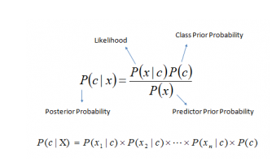

# Naive Bayes
This algorithm makes an assumption that all the variables in the dataset are “Naive” (Uncorrelated).
The parameters that are learned in Naive Bayes are the prior probabilities of different classes, as well as the likelihood of different features for each class.

Here is the naive bayes formula:

Why use naive bayes?
* Very simple to implement
* Doesn't require a lot of data
* Not sensitive to irrelevant features
* Highly scalable and fast

But we should keep in mind that in real life, it is almost impossible that we get a set of predictors which are completely independent.
Another thing to note is that if a given class and feature value never occur together in the training data, then the frequency-based probability estimate will be zero.

Here is a simple Naive Bayes implementation [code sample](naive_bayes.py)