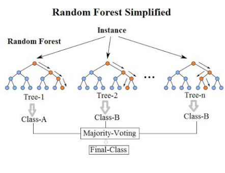

# Random Forest

A random forest creates a multitude of Decision trees and merges them together to obtain a more stable and accurate model.
When it comes to decision trees, it is an algorithm that can be used in regression and classification where data is continuously split according to specific parameters, it is 
made out of nodes (where we have a split) and leaves (leaving nodes).

In simple terms, each random forest has multiple decision trees and the result is determined by the highest number of votes between the trees.
Random Forests are trained via the bagging method. Bagging or Bootstrap Aggregating, consists of randomly sampling subsets of
the training data, fitting a model to these smaller data sets, and aggregating the predictions.

Why use random forests ?
* Since we are creating a multitude of decision trees, it naturally incorporates cross validation
* Great handling large datasets with high dimensionality

Here is a simple Random Forest implementation [code sample](random_forest.py)

## Reference(s)
[Random Forests](https://link.springer.com/article/10.1023/A:1010933404324)